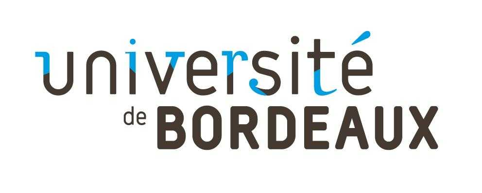
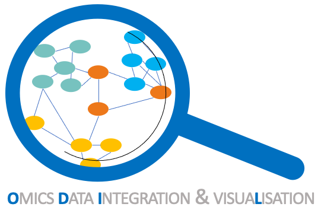

 

## Qui sommes-nous ?

La cellule de bioinformatique O·D·I·L (**O**mics **D**ata **I**ntegration & visua**L**isation) a pour but d'accompagner les membres du BRIC dans leur projet impliquant des expertises en bioinformatique suivant la stratégie présentée au travers de nos missions décrites dans la section éponyme.

_Comité exécutif_
-	Responsable Scientifique : Elodie Darbo
-	Cyril Dourthe

_Comité Utilisateurs·trices expert·e·s_
-	Anne-Aurélie Raymond
- Anne Persoz
-	Samuel Amintas
-	Audrey Gros
-	Jessica Massière

[Organigramme et logigramme](docs/presentation_gramme.md)

## Nos missions

-	Consolider le lien avec l' axe Santé-Numérique du Laboratoire Bordelais de Recherche en Informatique (LaBRI) par le co-encadrement de Master/Doctorant·e/Post-Doc et par l'organisation de rencontres LaBRIC entre les deux unités. Voir: [Qu'est-ce que le LaBRIC ?](docs/LaBRIC.md)
-	Encadrement de stagiaires en bioinformatique (M1/M2) et d’ingénieur·e·s (IE). Voir [Encadrements passés et en cours](docs/encadrement.md)
-	Accompagnement pour la réponse à des appels à projets
-	Développement d’outils interfacés et mise à disposition des chercheurs pour l’exploration et la visualisation de résultats
-	Mise en place progressive d’une base de données interne au BRIC
-	Formation à l’utilisation d’outils
-	Faire remonter les besoins des équipes pour aider à l’amélioration des outils (ex : ajout de fonctionnalités) ou pour la création de nouveaux outils grâce à des réunions régulières entre utilisteurs et concepteurs.

## Bac à sable

Nous mettons à disposition aux membres du BRIC une [boite à idées](https://bricbordeaux.sharepoint.com/:f:/s/Bioinformatique-ODILE/EmxWqC8e19hAnHp3BQSGqKEBFhAwiiDrJs9gmGC_MIia8g?e=80eBpz) dans laquelle vous pourrez y déposer vos idées concernant la visualisation de vos résultats. [Un modèle](https://bricbordeaux.sharepoint.com/:w:/s/Bioinformatique-ODILE/Ea2afKky_QdJjeY8pDzz2rwBYhwmXL-2KREUOgOLUKN98A?e=VdcPhy) y est d'ailleurs disponible. \
L'idée est de pouvoir identifier au sein de notre unité les compétences déjà présentes et de faciliter leurs échanges et transferts.

## Recensement des compétences

Nous mettons à disposition [un tableur](https://bricbordeaux.sharepoint.com/:x:/s/Bioinformatique-ODILE/Ee_IXmXP3r1LlPqMqxGpE40BX_I_AYMhtoLguku24_Qj5g?e=IrDkgL) où chacun est libre de s'y ajouter pour y faire apparaitre des compétences de tout niveau en bioinformatique. Cela peut concerner à la fois la maitrise de bases données ou d'outils en ligne, la montée en compétence d'analyse de données spécifiques (RNA-seq, CHIP-seq, single cell, protéomique spatiale etc.).

## Formations
### Initiation à la programmation en R pour la manipulation de tableaux et la représentation graphique des données  
_Les objectifs de cette formations sont:_
1- Connaitre les notions de base de la programmation R
2- Savoir lire du code R
3- Savoir chercher des informations sur le web
4- Savoir manipuler des tableaux avec dplyr
5- Savoir représenter les données sous forme de graphique avec ggplot2 (et d'autres supers outils)

_Les pré-requis:_
Il n'y a pas de pré-requis.

_Le public:_
Toute personne membre du BRIC (stagiaires, doctorant·e·s, post-doc, chercheurs·ses, technicien·ne·s etc) n'ayant aucune notion de programmation en R et souhaitant s'autonomiser sur l'analyse basique de données.

_Au programme:_
Analyse et visualisation de données d'expression des gènes et des caractéristiques cliniques de patient·e·s atteint·e·s de cancer du poumon.

_Liens vers les supports_

https://github.com/bric-bioinformatics/formation_R

_Prochaine session_

Quand : Les 11, 13 et 14 Mars 

Où: Salle informatique 213 du bâtiment d'Odontologie, site Carreire.

### Initiation aux biostatistiques 
A venir ...

## Evénements

**Save the date** : La cellule est en train d'organiser la seconde matinée de rencontre entre le BRIC et le LaBRIC qui aura lieu le **Vendredi 11 Avril** de **9h30** à **12h** à l'amphithéatre du BBS. Nous prévoyons une pause café afin de nous permettre d'échanger.

Programme à venir ...

## Nous joindre

Contact : elodie.darbo@u-bordeaux.fr
